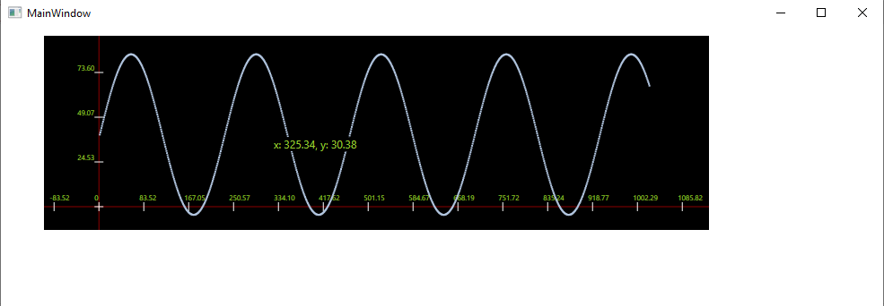

# Signal Plotting UI "Control"
I needed a fast plotting control to display output signal of one of the electronic measurement tools in real time, so I implemented this in C# WPF to be integrated to larget application.

 
